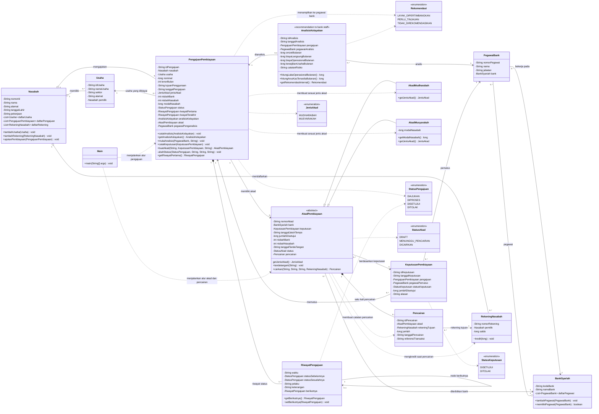
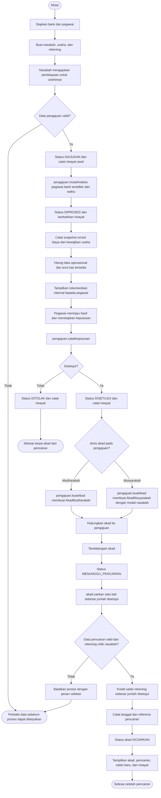

# UML dan Flowchart Pembiayaan Syariah

Diagram ini menggambarkan cakupan source saat ini: pengajuan pembiayaan
Mudharabah/Musyarakah, riwayat status pengajuan, persetujuan, akad, dan satu
kali pencairan penuh ke rekening nasabah. Proses berakhir setelah saldo
rekening bertambah.

## Class diagram

Notasi: `*--` adalah komposisi, `o--` adalah agregasi, panah segitiga kosong
menunjukkan pewarisan, dan garis putus-putus menunjukkan ketergantungan.
Tanda `~` menunjukkan akses package-private. `getJenisAkad()` dideklarasikan
abstrak pada `AkadPembiayaan` dan diimplementasikan oleh kedua turunannya.

## Flowchart

Rekomendasi adalah alat bantu internal bagi pegawai, bukan keputusan otomatis
dan bukan pesan persetujuan kepada nasabah. Rumus snapshot:
`laba operasional = omzet - biaya langsung - biaya operasional` dan
`arus kas tersedia = laba operasional - kewajiban usaha`. Hasil positif,
nol, dan negatif masing-masing menghasilkan rekomendasi
`LAYAK_DIPERTIMBANGKAN`, `PERLU_TINJAUAN`, dan `TIDAK_DIREKOMENDASIKAN`.
`Rekomendasi` adalah enum yang didefinisikan di dalam `AnalisisKelayakan`.

## Batas alur

- Satu akad hanya memiliki satu pencairan penuh.
- Pencairan menggunakan nominal keputusan yang disetujui; pengguna tidak
  mengisi nominal pencairan terpisah.
- Rekening nasabah dikredit saat pencairan berhasil.
- Setelah status akad `DICAIRKAN`, tidak ada proses lanjutan dalam cakupan
  program saat ini.
- Riwayat linked list hanya untuk perubahan status pengajuan.
