# Diagram UML dan Flowchart Sistem Pembiayaan Syariah

Dokumen ini menggambarkan struktur source Java saat ini, bukan rancangan fitur
masa depan. Tipe nilai uang memakai `long` (rupiah) dan tanggal/waktu masih
disimpan sebagai `String`, sesuai implementasi demo. Getter sederhana dan
`toString()` tidak ditampilkan seluruhnya agar kotak UML tetap mudah dibaca;
atribut domain serta operasi yang mengubah atau menghitung proses ditampilkan.

## 1. Class diagram

```mermaid
classDiagram
direction LR

class Main {
  +main(String[] args) void
}

class BankSyariah {
  -String kodeBank
  -String namaBank
  -List~PegawaiBank~ daftarPegawai
  +tambahPegawai(PegawaiBank) void
  +getDaftarPegawai() List~PegawaiBank~
}

class PegawaiBank {
  -String nomorPegawai
  -String nama
  -String jabatan
  -BankSyariah bank
}

class Nasabah {
  -String nomorId
  -String nama
  -String alamat
  -String tanggalLahir
  -String pekerjaan
  -ProfilKeuangan profilKeuangan
  -List~Usaha~ daftarUsaha
  -List~PengajuanPembiayaan~ daftarPengajuan
  -List~RekeningNasabah~ daftarRekening
  +tambahUsaha(Usaha) void
  +tambahRekening(RekeningNasabah) void
  +ajukanPembiayaan(PengajuanPembiayaan) void
}

class ProfilKeuangan {
  <<static>>
  -long gajiBulanan
  -long pendapatanLainBulanan
  -long kewajibanBulanan
  -int jumlahTanggungan
  -long totalAset
  -String tanggalPembaruan
  +hitungPendapatanBulanan() long
  +hitungSisaPendapatanBulanan() long
  +perbaruiData(...) void
}

class Usaha {
  -String idUsaha
  -String namaUsaha
  -String sektor
  -String alamat
  -Nasabah pemilik
}

class RekeningNasabah {
  -String nomorRekening
  -Nasabah pemilik
  -long saldo
  +getSaldo() long
  ~kredit(long) void
  ~debit(long) void
}

class PengajuanPembiayaan {
  -String idPengajuan
  -Nasabah nasabah
  -Usaha usaha
  -long nominal
  -int tenorBulan
  -String tujuanPenggunaan
  -String tanggalPengajuan
  -JenisAkad jenisAkad
  -int nisbahBank
  -int nisbahNasabah
  -long modalNasabah
  -StatusPengajuan status
  -RiwayatPengajuan riwayatPertama
  -RiwayatPengajuan riwayatTerakhir
  -AnalisisKelayakan analisisKelayakan
  -AkadPembiayaan akad
  +catatAnalisis(AnalisisKelayakan) void
  +catatAkad(AkadPembiayaan) void
  +ubahStatus(StatusPengajuan, String, String, String) void
  +getRiwayatPertama() RiwayatPengajuan
}

class RiwayatPengajuan {
  -String waktu
  -StatusPengajuan statusSebelumnya
  -StatusPengajuan statusSesudahnya
  -String pelaku
  -String keterangan
  -RiwayatPengajuan berikutnya
  +getBerikutnya() RiwayatPengajuan
  ~setBerikutnya(RiwayatPengajuan) void
}

class AnalisisKelayakan {
  -String idAnalisis
  -String tanggalAnalisis
  -PengajuanPembiayaan pengajuan
  -PegawaiBank pegawaiAnalisis
  -String ringkasan
  -String catatanRisiko
}

class KeputusanPembiayaan {
  -String idKeputusan
  -String tanggalKeputusan
  -PengajuanPembiayaan pengajuan
  -PegawaiBank pegawaiPemutus
  -StatusKeputusan statusKeputusan
  -long jumlahDisetujui
  -String alasan
}

class AkadPembiayaan {
  <<abstract>>
  -String nomorAkad
  -BankSyariah bank
  -KeputusanPembiayaan keputusan
  -String tanggalTandaTangan
  -String tanggalMulai
  -String tanggalJatuhTempo
  -long jumlahDisetujui
  -int nisbahBank
  -int nisbahNasabah
  -StatusAkad status
  -List~Pencairan~ daftarPencairan
  -List~Pembayaran~ daftarPembayaran
  -List~PerhitunganBagiHasil~ daftarPerhitunganBagiHasil
  -List~KerugianUsaha~ daftarKerugianUsaha
  -List~EvaluasiKerugian~ daftarEvaluasiKerugian
  *getJenisAkad() JenisAkad
  +tandatangani(String) void
  +tambahPencairan(Pencairan) void
  +catatPerhitunganBagiHasil(PerhitunganBagiHasil) void
  +catatKerugianUsaha(KerugianUsaha) void
  +catatEvaluasiKerugian(EvaluasiKerugian) void
  +daftarkanPembayaran(Pembayaran) void
  +catatPembayaranBerhasil(Pembayaran, String) void
  +catatPembayaranGagal(Pembayaran) void
  +hitungSisaPengembalianModal() long
  +hitungSisaTotalBagiHasil() long
  +hitungSisaTotalGantiRugi() long
  +hentikanDini() void
  +selesaikan() void
}

class AkadMudharabah {
  +getJenisAkad() JenisAkad
}

class AkadMusyarakah {
  -long modalNasabah
  -long modalNasabahDisertakan
  +getModalNasabah() long
  +getModalNasabahDisertakan() long
  +catatModalNasabahDisertakan(long) void
  +getJenisAkad() JenisAkad
}

class Pencairan {
  -String idPencairan
  -AkadPembiayaan akad
  -RekeningNasabah rekeningNasabah
  -long jumlah
  -String tanggalPencairan
  -String rekeningTujuan
  -StatusPencairan status
  -String referensiTransaksi
  +catatBerhasil(String) void
  +catatGagal() void
}

class LaporanUsaha {
  -String idLaporan
  -AkadPembiayaan akad
  -String periode
  -String tanggalPengiriman
  -long pendapatan
  -long biaya
  -StatusLaporan status
  -String catatan
  +hitungLabaRugi() long
  +mulaiVerifikasi() void
}

class VerifikasiLaporan {
  -String idVerifikasi
  -LaporanUsaha laporan
  -PegawaiBank pegawaiPemeriksa
  -String tanggalVerifikasi
  -HasilVerifikasi hasil
  -String catatan
}

class PerhitunganBagiHasil {
  -String idPerhitungan
  -VerifikasiLaporan verifikasi
  -AkadPembiayaan akad
  -String tanggalPerhitungan
  -long labaBersih
  -long bagianBank
  -long bagianNasabah
}

class KerugianUsaha {
  -String idKerugian
  -VerifikasiLaporan verifikasi
  -String tanggalPencatatan
  -String keterangan
  -AkadPembiayaan akad
  -long jumlahKerugian
  -long bagianKerugianBank
  -long bagianKerugianNasabah
}

class EvaluasiKerugian {
  -String idEvaluasi
  -KerugianUsaha kerugian
  -PegawaiBank pegawaiPemeriksa
  -String tanggalEvaluasi
  -JenisTemuanKerugian jenisTemuan
  -HasilEvaluasiKerugian hasil
  -long jumlahGantiRugi
  -String catatan
  +selesaikanPemeriksaan(HasilEvaluasiKerugian, long) void
}

class Pembayaran {
  -String idPembayaran
  -AkadPembiayaan akad
  -RekeningNasabah rekeningSumber
  -PerhitunganBagiHasil perhitunganBagiHasil
  -String tanggalPembayaran
  -long jumlahPengembalianModal
  -long jumlahBagiHasil
  -EvaluasiKerugian evaluasiKerugian
  -long jumlahGantiRugi
  -StatusPembayaran status
  -String referensiTransaksi
  +getJumlahTotal() long
}

class PengajuanService {
  +mulaiAnalisis(PengajuanPembiayaan, PegawaiBank, String) void
  +catatKeputusan(KeputusanPembiayaan) void
}

class AkadService {
  +buatAkad(String, KeputusanPembiayaan, String) AkadPembiayaan
}

class PencairanService {
  +daftarkanPencairan(String, AkadPembiayaan, long, String, RekeningNasabah) Pencairan
  +catatPencairanBerhasil(Pencairan, String) void
  +catatPencairanGagal(Pencairan) void
}

class PembayaranService {
  +daftarkanPembayaran(String, AkadPembiayaan, PerhitunganBagiHasil, String, long, long, RekeningNasabah) Pembayaran
  +daftarkanPembayaran(String, AkadPembiayaan, PerhitunganBagiHasil, String, long, long, EvaluasiKerugian, long, RekeningNasabah) Pembayaran
  +catatPembayaranBerhasil(Pembayaran, String) void
  +catatPembayaranGagal(Pembayaran) void
}

class JenisAkad {
  <<enumeration>>
  MUDHARABAH
  MUSYARAKAH
}
class StatusPengajuan {
  <<enumeration>>
  DIAJUKAN
  DIPROSES
  DISETUJUI
  DITOLAK
}
class StatusKeputusan {
  <<enumeration>>
  DISETUJUI
  DITOLAK
}
class StatusAkad {
  <<enumeration>>
  DRAFT
  MENUNGGU_PENCAIRAN
  AKTIF
  SELESAI
  DITERMINASI
}
class StatusPencairan {
  <<enumeration>>
  DICATAT
  BERHASIL
  GAGAL
}
class StatusLaporan {
  <<enumeration>>
  TERKIRIM
  DALAM_VERIFIKASI
  PERLU_PERBAIKAN
  TERVERIFIKASI
}
class HasilVerifikasi {
  <<enumeration>>
  DITERIMA
  PERLU_PERBAIKAN
}
class StatusPembayaran {
  <<enumeration>>
  DICATAT
  BERHASIL
  GAGAL
}
class JenisTemuanKerugian {
  <<enumeration>>
  KELALAIAN
  PELANGGARAN
}
class HasilEvaluasiKerugian {
  <<enumeration>>
  DALAM_PEMERIKSAAN
  TIDAK_TERBUKTI
  TERBUKTI
}

Nasabah "1" *-- "1" ProfilKeuangan : profil
Nasabah "1" -- "0..*" Usaha : memiliki
Nasabah "1" -- "0..*" RekeningNasabah : mendaftarkan
Nasabah "1" -- "0..*" PengajuanPembiayaan : mengajukan
Usaha "1" -- "0..*" PengajuanPembiayaan : menjadi objek
PengajuanPembiayaan "1" *-- "1..*" RiwayatPengajuan : linked list
RiwayatPengajuan "1" --> "0..1" RiwayatPengajuan : berikutnya
PengajuanPembiayaan "1" <-- "0..1" AnalisisKelayakan : analisis untuk
AnalisisKelayakan "0..*" --> "1" PegawaiBank : dianalisis oleh
KeputusanPembiayaan "0..*" --> "1" PengajuanPembiayaan : keputusan atas
KeputusanPembiayaan "0..*" --> "1" PegawaiBank : diputus oleh
PengajuanPembiayaan "1" --> "0..1" AkadPembiayaan : akad
AkadPembiayaan <|-- AkadMudharabah
AkadPembiayaan <|-- AkadMusyarakah
AkadPembiayaan "0..*" --> "1" BankSyariah : dikelola oleh
AkadPembiayaan "0..*" --> "1" KeputusanPembiayaan : dibuat dari
BankSyariah "1" -- "0..*" PegawaiBank : mempekerjakan
AkadPembiayaan "1" o-- "0..*" Pencairan : pencairan
Pencairan "0..*" --> "1" RekeningNasabah : rekening tujuan
AkadPembiayaan "1" o-- "0..*" Pembayaran : pembayaran
Pembayaran "0..*" --> "1" RekeningNasabah : rekening sumber
Pembayaran "0..*" --> "0..1" PerhitunganBagiHasil : melunasi bagian hasil
Pembayaran "0..*" --> "0..1" EvaluasiKerugian : membayar ganti rugi
LaporanUsaha "0..*" --> "1" AkadPembiayaan : laporan untuk
VerifikasiLaporan "0..1" --> "1" LaporanUsaha : memverifikasi
VerifikasiLaporan "0..*" --> "1" PegawaiBank : diperiksa oleh
PerhitunganBagiHasil "0..1" --> "1" VerifikasiLaporan : hasil verifikasi
KerugianUsaha "0..1" --> "1" VerifikasiLaporan : hasil verifikasi
EvaluasiKerugian "0..1" --> "1" KerugianUsaha : evaluasi
EvaluasiKerugian "0..*" --> "1" PegawaiBank : diperiksa oleh
AkadPembiayaan "1" o-- "0..*" PerhitunganBagiHasil : menyimpan
AkadPembiayaan "1" o-- "0..*" KerugianUsaha : menyimpan
AkadPembiayaan "1" o-- "0..*" EvaluasiKerugian : menyimpan

PengajuanService ..> PengajuanPembiayaan : mengatur status
PengajuanService ..> KeputusanPembiayaan : mencatat
AkadService ..> AkadPembiayaan : membuat jenis akad
AkadService ..> PengajuanPembiayaan : membaca jenis akad
PencairanService ..> Pencairan : mendaftarkan dan memproses
PembayaranService ..> Pembayaran : mendaftarkan dan memproses
Main ..> PengajuanService : merangkai demo
Main ..> AkadService : merangkai demo
Main ..> PencairanService : merangkai demo
Main ..> PembayaranService : merangkai demo

PengajuanPembiayaan ..> JenisAkad
PengajuanPembiayaan ..> StatusPengajuan
RiwayatPengajuan ..> StatusPengajuan
KeputusanPembiayaan ..> StatusKeputusan
AkadPembiayaan ..> StatusAkad
Pencairan ..> StatusPencairan
LaporanUsaha ..> StatusLaporan
VerifikasiLaporan ..> HasilVerifikasi
Pembayaran ..> StatusPembayaran
EvaluasiKerugian ..> JenisTemuanKerugian
EvaluasiKerugian ..> HasilEvaluasiKerugian
AkadPembiayaan ..> JenisAkad
```

**Cara membaca:** komposisi `*--` menandai data bagian yang dibuat bersama
objek pemiliknya, seperti profil keuangan dan node riwayat. Agregasi `o--`
menandai daftar objek transaksi/hasil yang dikumpulkan akad. Panah putus-putus
menandai pemakaian/ketergantungan, seperti service terhadap model.

## 2. Flowchart alur bisnis

```mermaid
flowchart TD
    A([Mulai]) --> B[Siapkan bank, pegawai, nasabah, usaha, dan rekening]
    B --> C[Nasabah mengajukan pembiayaan untuk usaha miliknya]
    C --> D{Data pengajuan valid?}
    D -- Tidak --> D1[Input tidak valid: exception pada demo]
    D1 --> Z2([Selesai: data perlu diperbaiki lalu demo dijalankan ulang])
    D -- Ya --> E[Status DIAJUKAN dan buat node awal riwayat]
    E --> F[Mulai analisis dan ubah status ke DIPROSES]
    F --> G[Catat AnalisisKelayakan]
    G --> H[Buat keputusan pembiayaan]
    H --> I{Keputusan disetujui?}
    I -- Tidak --> J[Status pengajuan DITOLAK dan catat riwayat]
    J --> Z1([Selesai: pengajuan ditolak])
    I -- Ya --> K[Status pengajuan DISETUJUI dan catat riwayat]
    K --> L{Jenis akad?}

    L -- Mudharabah --> M[Buat AkadMudharabah]
    L -- Musyarakah --> N[Buat AkadMusyarakah dan tetapkan modal nasabah]
    M --> O[Catat akad pada pengajuan]
    N --> O
    O --> P[Tandatangani akad: DRAFT ke MENUNGGU_PENCAIRAN]
    P --> Q[Daftarkan pencairan ke rekening nasabah]
    Q --> R{Pencairan berhasil?}
    R -- Tidak --> R1[Catat pencairan GAGAL; tidak ada kredit rekening]
    R1 --> R2{Ajukan pencairan ulang?}
    R2 -- Ya --> Q
    R2 -- Tidak --> R3([Menunggu tindak lanjut; akad belum aktif])
    R -- Ya --> S[Kredit rekening dan aktifkan akad]
    S --> T{Akad Musyarakah?}
    T -- Ya --> T1[Catat modal aktual nasabah disertakan]
    T -- Tidak --> U
    T1 --> U

    U[Nasabah mengirim laporan usaha] --> V[Laporan mulai berstatus TERKIRIM]
    V --> W[Mulai verifikasi laporan]
    W --> X{Hasil verifikasi?}
    X -- Perlu perbaikan --> X1[Status PERLU_PERBAIKAN]
    X1 --> X2([Perlu revisi manual: alur kirim ulang belum diimplementasikan])
    X -- Diterima --> Y[Status laporan TERVERIFIKASI]
    Y --> AA{Pendapatan dikurangi biaya}
    AA -- Lebih besar dari 0 --> AB[Hitung PerhitunganBagiHasil dari nisbah]
    AB --> AC[Catat perhitungan bagi hasil pada akad]
    AA -- Sama dengan 0 --> AD[Impas: tidak ada bagi hasil atau alokasi rugi]
    AA -- Kurang dari 0 --> AE[Buat KerugianUsaha dan hitung alokasi normal]
    AE --> AF{Perlu evaluasi kelalaian/pelanggaran?}
    AF -- Tidak --> AJ
    AF -- Ya --> AG[Catat EvaluasiKerugian berstatus DALAM_PEMERIKSAAN]
    AG --> AH{Hasil pemeriksaan}
    AH -- Masih diperiksa --> AI[Belum boleh menyelesaikan akad]
    AI --> AH
    AH -- Tidak terbukti --> AH1[Tetapkan TIDAK_TERBUKTI dan ganti rugi Rp0]
    AH -- Terbukti --> AH2[Tetapkan TERBUKTI dan nominal ganti rugi]
    AH1 --> AJ
    AH2 --> AJ

    AC --> AJ{Ada laporan periode berikutnya?}
    AD --> AJ
    AJ -- Ya --> U
    AJ -- Tidak --> AK{Akad dihentikan dini?}
    AK -- Ya --> AL[Status DITERMINASI: hentikan aktivitas baru]
    AK -- Tidak --> AM[Akad tetap AKTIF sampai kewajiban diselesaikan]
    AL --> AN
    AM --> AN

    AN[Daftarkan pembayaran: modal, bagi hasil, dan/atau ganti rugi] --> AO{Pembayaran valid dan saldo cukup?}
    AO -- Tidak --> AP[Catat gagal atau koreksi jumlah; saldo tidak berubah]
    AP --> AN
    AO -- Ya --> AQ[Debit rekening dan catat transaksi BERHASIL]
    AQ --> AR{Masih ada sisa modal, bagi hasil, atau ganti rugi?}
    AR -- Ya --> AN
    AR -- Tidak --> AS{Masih ada pencairan/pembayaran DICATAT atau evaluasi DALAM_PEMERIKSAAN?}
    AS -- Ya --> AT[Proses transaksi atau selesaikan pemeriksaan]
    AT --> AS
    AS -- Tidak --> AU[Akad SELESAI]
    AU --> Z([Selesai])
```

## 3. Catatan aturan dan batas implementasi

- Status pengajuan yang tersedia: `DIAJUKAN -> DIPROSES -> DISETUJUI` atau
  `DITOLAK`. Perubahan status pengajuan dicatat dalam linked list
  `RiwayatPengajuan`.
- Pencairan pertama yang berhasil mengaktifkan akad dan mengkredit rekening.
  Nilai pencairan kumulatif tidak boleh melewati jumlah yang disetujui.
- Laba membentuk perhitungan bagi hasil berdasarkan nisbah. Rugi membentuk
  alokasi kerugian normal; untuk Musyarakah, alokasi memakai modal bank yang
  berhasil dicairkan dan modal nasabah aktual yang dicatat. Impas tidak
  membentuk keduanya.
- Evaluasi kerugian tidak mengganti alokasi rugi normal. Jika terbukti, nominal
  ganti rugi yang ditetapkan dicatat terpisah dan menjadi komponen pembayaran.
- Penghentian dini mengubah status ke `DITERMINASI` dan menghentikan aktivitas
  baru, tetapi pembayaran kewajiban yang masih tersisa tetap dapat dicatat.
- `selesaikan()` hanya mengubah status ke `SELESAI` jika kewajiban modal, bagi
  hasil, dan ganti rugi lunas; tidak ada pencairan/pembayaran berstatus
  `DICATAT`; serta tidak ada evaluasi yang masih `DALAM_PEMERIKSAAN`.
- Jalur laporan `PERLU_PERBAIKAN` saat ini hanya mengubah status laporan.
  Fungsi edit dan pengiriman ulang laporan belum ada.
- Model akad menyimpan daftar pencairan, pembayaran, perhitungan bagi hasil,
  kerugian, dan evaluasi. Belum ada daftar arsip laporan/verifikasi pada akad
  maupun log transaksi umum; objek laporan tersambung melalui objek hasil
  verifikasi, perhitungan bagi hasil, dan kerugian.
- Diagram menunjukkan kapabilitas model. Demo aktif di `src/Main.java`
  menjalankan satu pilihan skenario saja: Mudharabah, laporan rugi,
  pemeriksaan kelalaian terbukti, penghentian dini, pembayaran modal dan
  ganti rugi.
