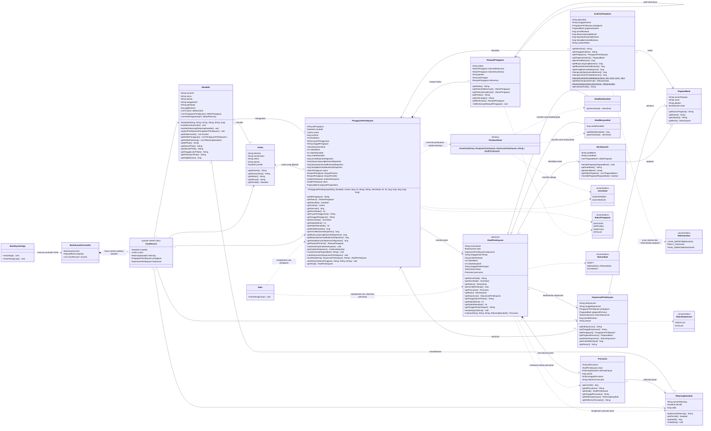

## Class diagram

```mermaid
classDiagram
direction LR

class Main {
  +main(String[] args) void
}

class BankSyariahApp {
  +start(Stage) void
  +main(String[] args) void
}

class BankSyariahController {
  -BankSyariah bank
  -PegawaiBank pegawai
  -List~CaseRecord~ records
}

class CaseRecord {
  <<private nested class>>
  -Nasabah nasabah
  -Usaha usaha
  -RekeningNasabah rekening
  -PengajuanPembiayaan pengajuan
  -KeputusanPembiayaan keputusan
}

class BankSyariah {
  -String kodeBank
  -String namaBank
  -List~PegawaiBank~ daftarPegawai
  +tambahPegawai(PegawaiBank) void
  +getKodeBank() String
  +getNamaBank() String
  +getDaftarPegawai() List~PegawaiBank~
  +memilikiPegawai(PegawaiBank) boolean
}

class PegawaiBank {
  -String nomorPegawai
  -String nama
  -String jabatan
  -BankSyariah bank
  +getNomorPegawai() String
  +getNama() String
  +getJabatan() String
  +getBank() BankSyariah
}

class Nasabah {
  -String nomorId
  -String nama
  -String alamat
  -String tanggalLahir
  -String pekerjaan
  -long gajiBulanan
  -List~Usaha~ daftarUsaha
  -List~PengajuanPembiayaan~ daftarPengajuan
  -List~RekeningNasabah~ daftarRekening
  +Nasabah(String, String, String, String, String, long)
  +tambahUsaha(Usaha) void
  +tambahRekening(RekeningNasabah) void
  +ajukanPembiayaan(PengajuanPembiayaan) void
  +getDaftarUsaha() List~Usaha~
  +getDaftarPengajuan() List~PengajuanPembiayaan~
  +getDaftarRekening() List~RekeningNasabah~
  +getIdPihak() String
  +getNamaPihak() String
  +getAlamatPihak() String
  +getTanggalLahirPihak() String
  +getPekerjaanPihak() String
  +getGajiBulanan() long
}

class Usaha {
  -String idUsaha
  -String namaUsaha
  -String sektor
  -String alamat
  -Nasabah pemilik
  +getIdUsaha() String
  +getNamaUsaha() String
  +getSektor() String
  +getAlamat() String
  +getPemilik() Nasabah
}

class RekeningNasabah {
  -String nomorRekening
  -Nasabah pemilik
  -long saldo
  +getNomorRekening() String
  +getPemilik() Nasabah
  +getSaldo() long
  ~kredit(long) void
}

class PengajuanPembiayaan {
  -String idPengajuan
  -Nasabah nasabah
  -Usaha usaha
  -long nominal
  -int tenorBulan
  -String tujuanPenggunaan
  -String tanggalPengajuan
  -JenisAkad jenisAkad
  -int nisbahBank
  -int nisbahNasabah
  -long modalNasabah
  -long omzetBulananDilaporkan
  -long biayaLangsungBulananDilaporkan
  -long biayaOperasionalBulananDilaporkan
  -long kewajibanUsahaBulananDilaporkan
  -StatusPengajuan status
  -RiwayatPengajuan riwayatPertama
  -RiwayatPengajuan riwayatTerakhir
  -AnalisisKelayakan analisisKelayakan
  -AkadPembiayaan akad
  -PegawaiBank pegawaiPenganalisis
  +PengajuanPembiayaan(String, Nasabah, Usaha, long, int, String, String, JenisAkad, int, int, long, long, long, long, long)
  +getIdPengajuan() String
  +getStatus() StatusPengajuan
  +getNasabah() Nasabah
  +getUsaha() Usaha
  +getNominal() long
  +getTenorBulan() int
  +getTujuanPenggunaan() String
  +getTanggalPengajuan() String
  +getJenisAkad() JenisAkad
  +getNisbahBank() int
  +getNisbahNasabah() int
  +getModalNasabah() long
  +getOmzetBulananDilaporkan() long
  +getBiayaLangsungBulananDilaporkan() long
  +getBiayaOperasionalBulananDilaporkan() long
  +getKewajibanUsahaBulananDilaporkan() long
  +getRiwayatPertama() RiwayatPengajuan
  +catatAnalisis(AnalisisKelayakan) void
  +getAnalisisKelayakan() AnalisisKelayakan
  +mulaiAnalisis(PegawaiBank, String) void
  +catatKeputusan(KeputusanPembiayaan) void
  +buatAkad(String, KeputusanPembiayaan, String) AkadPembiayaan
  -ubahStatus(StatusPengajuan, String, String, String) void
  +getAkad() AkadPembiayaan
}

class RiwayatPengajuan {
  -String waktu
  -StatusPengajuan statusSebelumnya
  -StatusPengajuan statusSesudahnya
  -String pelaku
  -String keterangan
  -RiwayatPengajuan berikutnya
  +getWaktu() String
  +getStatusSebelumnya() StatusPengajuan
  +getStatusSesudahnya() StatusPengajuan
  +getPelaku() String
  +getKeterangan() String
  +getBerikutnya() RiwayatPengajuan
  ~setBerikutnya(RiwayatPengajuan) void
}

class AnalisisKelayakan {
  -String idAnalisis
  -String tanggalAnalisis
  -PengajuanPembiayaan pengajuan
  -PegawaiBank pegawaiAnalisis
  -long omzetBulanan
  -long biayaLangsungBulanan
  -long biayaOperasionalBulanan
  -long kewajibanUsahaBulanan
  -String catatanRisiko
  +getIdAnalisis() String
  +getTanggalAnalisis() String
  +getPengajuan() PengajuanPembiayaan
  +getPegawaiAnalisis() PegawaiBank
  +getOmzetBulanan() long
  +getBiayaLangsungBulanan() long
  +getBiayaOperasionalBulanan() long
  +getKewajibanUsahaBulanan() long
  +hitungLabaOperasionalBulanan() long
  +hitungArusKasTersediaBulanan() long
  +hitungArusKasTersediaBulanan(long, long, long, long)$ long
  +getRekomendasiInternal() Rekomendasi
  +rekomendasiUntukArusKas(long)$ Rekomendasi
  +getCatatanRisiko() String
}

class Rekomendasi {
  <<enumeration>>
  LAYAK_DIPERTIMBANGKAN
  PERLU_TINJAUAN
  TIDAK_DIREKOMENDASIKAN
}

class KeputusanPembiayaan {
  -String idKeputusan
  -String tanggalKeputusan
  -PengajuanPembiayaan pengajuan
  -PegawaiBank pegawaiPemutus
  -StatusKeputusan statusKeputusan
  -long jumlahDisetujui
  -String alasan
  +getIdKeputusan() String
  +getTanggalKeputusan() String
  +getPengajuan() PengajuanPembiayaan
  +getPegawaiPemutus() PegawaiBank
  +getStatusKeputusan() StatusKeputusan
  +getJumlahDisetujui() long
  +getAlasan() String
}

class PembuatAkad {
  <<factory>>
  +buatAkad(String, PengajuanPembiayaan, KeputusanPembiayaan, String)$ AkadPembiayaan
}

class AkadPembiayaan {
  <<abstract>>
  -String nomorAkad
  -BankSyariah bank
  -KeputusanPembiayaan keputusan
  -String tanggalJatuhTempo
  -long jumlahDisetujui
  -int nisbahBank
  -int nisbahNasabah
  -String tanggalTandaTangan
  -StatusAkad status
  -Pencairan pencairan
  +getNomorAkad() String
  +getJenisAkad() JenisAkad
  +getStatus() StatusAkad
  +getJumlahDisetujui() long
  +getPencairan() Pencairan
  +getBank() BankSyariah
  +getKeputusan() KeputusanPembiayaan
  +getTanggalJatuhTempo() String
  +getNisbahBank() int
  +getNisbahNasabah() int
  +getTanggalTandaTangan() String
  +tandatangani(String) void
  +cairkan(String, String, String, RekeningNasabah) Pencairan
}

class AkadMudharabah {
  +getJenisAkad() JenisAkad
}

class AkadMusyarakah {
  -long modalNasabah
  +getModalNasabah() long
  +getJenisAkad() JenisAkad
}

class Pencairan {
  -String idPencairan
  -AkadPembiayaan akad
  -RekeningNasabah rekeningTujuan
  -long jumlah
  -String tanggalPencairan
  -String referensiTransaksi
  +getJumlah() long
  +getIdPencairan() String
  +getAkad() AkadPembiayaan
  +getTanggalPencairan() String
  +getRekeningTujuan() RekeningNasabah
  +getReferensiTransaksi() String
}

class JenisAkad {
  <<enumeration>>
  MUDHARABAH
  MUSYARAKAH
}

class StatusPengajuan {
  <<enumeration>>
  DIAJUKAN
  DIPROSES
  DISETUJUI
  DITOLAK
}

class StatusKeputusan {
  <<enumeration>>
  DISETUJUI
  DITOLAK
}

class StatusAkad {
  <<enumeration>>
  DRAFT
  MENUNGGU_PENCAIRAN
  DICAIRKAN
}

Nasabah "1" o-- "0..*" Usaha : memiliki
Nasabah "1" o-- "0..*" RekeningNasabah : mendaftarkan
Nasabah "1" o-- "0..*" PengajuanPembiayaan : mengajukan
Usaha "1" <-- "0..*" PengajuanPembiayaan : usaha yang dibiayai
PengajuanPembiayaan "1" *-- "1..*" RiwayatPengajuan : riwayat status
RiwayatPengajuan "1" --> "0..1" RiwayatPengajuan : node berikutnya
PengajuanPembiayaan "1" <-- "0..1" AnalisisKelayakan : dianalisis
AnalisisKelayakan "0..*" --> "1" PegawaiBank : analis
KeputusanPembiayaan "0..1" --> "1" PengajuanPembiayaan : memutus
KeputusanPembiayaan "0..*" --> "1" PegawaiBank : pemutus
PengajuanPembiayaan "1" --> "0..1" AkadPembiayaan : memiliki akad
AkadPembiayaan <|-- AkadMudharabah
AkadPembiayaan <|-- AkadMusyarakah
BankSyariah "1" o-- "0..*" PegawaiBank : pegawai
AkadPembiayaan "0..*" --> "1" BankSyariah : diterbitkan bank
AkadPembiayaan "0..*" --> "1" KeputusanPembiayaan : berdasarkan keputusan
AkadPembiayaan "1" *-- "0..1" Pencairan : satu kali pencairan
Pencairan "0..*" --> "1" RekeningNasabah : rekening tujuan

BankSyariahApp ..> BankSyariahController : memuat controller FXML
BankSyariahController "1" *-- "0..*" CaseRecord : kasus selama aplikasi berjalan
CaseRecord "1" --> "1" Nasabah
CaseRecord "1" --> "1" Usaha
CaseRecord "1" --> "1" RekeningNasabah
CaseRecord "1" --> "1" PengajuanPembiayaan
CaseRecord "1" --> "0..1" KeputusanPembiayaan

PengajuanPembiayaan ..> PembuatAkad : meminta pembuatan setelah disetujui
PembuatAkad ..> AkadMudharabah : memilih untuk Mudharabah
PembuatAkad ..> AkadMusyarakah : memilih untuk Musyarakah
PembuatAkad ..> JenisAkad : memilih subtype
AkadPembiayaan ..> RekeningNasabah : mengkredit saat pencairan
AkadPembiayaan ..> Pencairan : membuat catatan pencairan
Main ..> PengajuanPembiayaan : menjalankan alur pengajuan
Main ..> AkadPembiayaan : menjalankan alur akad dan pencairan

PengajuanPembiayaan ..> JenisAkad
PengajuanPembiayaan ..> StatusPengajuan
AnalisisKelayakan ..> Rekomendasi : enum internal dan rekomendasi pegawai
RiwayatPengajuan ..> StatusPengajuan
KeputusanPembiayaan ..> StatusKeputusan
AkadPembiayaan ..> StatusAkad
```
